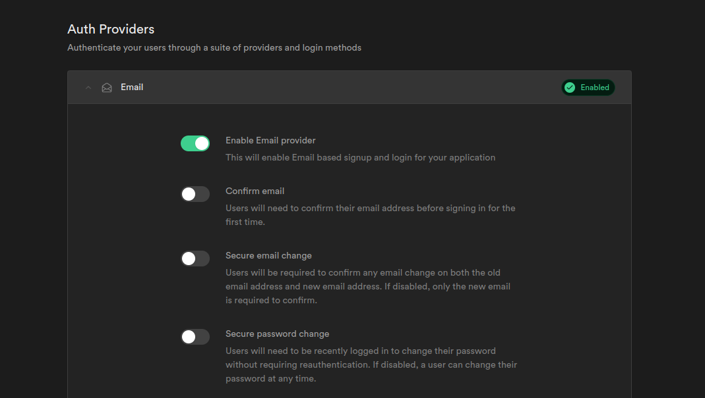

# chat_group

**Introducing our sleek and user-friendly chat group app, built with Flutter and powered by Supabase.** Stay connected with friends, family, or colleagues effortlessly through real-time messaging and group chats. With Supabase handling the backend, enjoy secure and reliable data storage and synchronization, ensuring your conversations are always up-to-date across devices. Whether you're organizing events, collaborating on projects, or simply catching up, our app provides a seamless and intuitive experience for all your communication needs.

# Info
the back end service is [Supabase](https://supabase.com/)
to add supabase into your flutter project just run this command in the project terminal
`flutter pub add supabase_flutter`
for more information go to 
- [supabase_flutter](https://pub.dev/packages/supabase_flutter)
- [supabase_document](https://supabase.com/docs/guides/getting-started/tutorials/with-flutter)

# Look Here
**I created this application as a challenge to develop an app in less than 40 minutes, without using state management and potentially having many errors (but it's not bad considering the time constraint).**

# Tips

**you have to disable the secure policy in your tables and you need to turn off the email confirm like here:**

